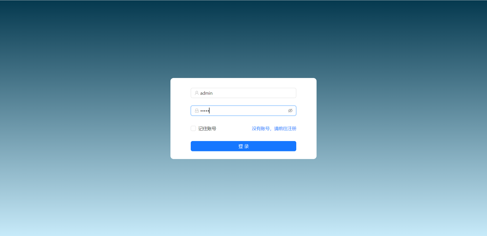
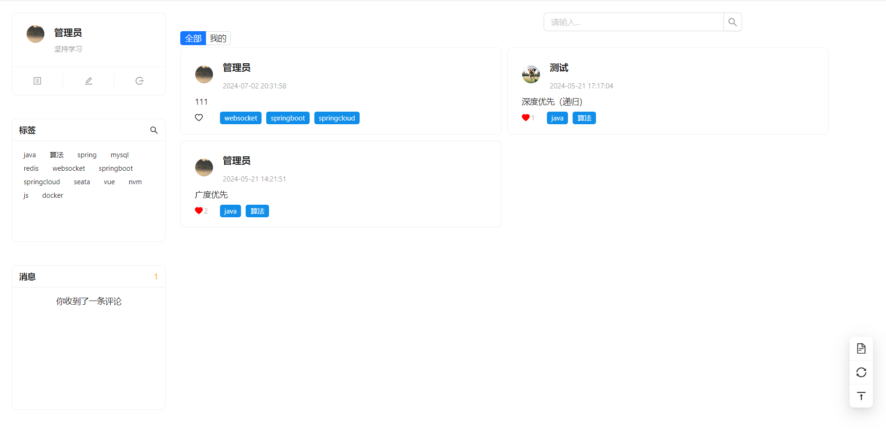
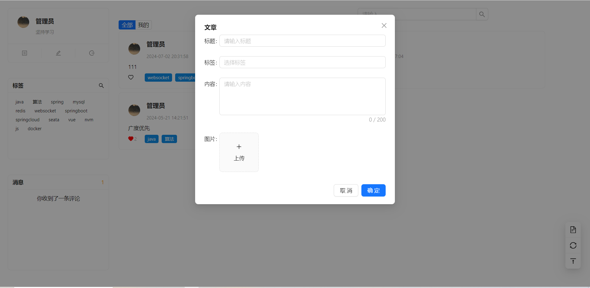
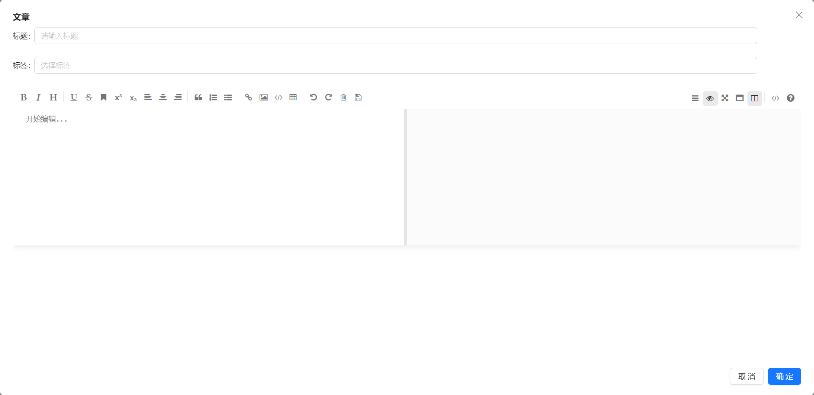
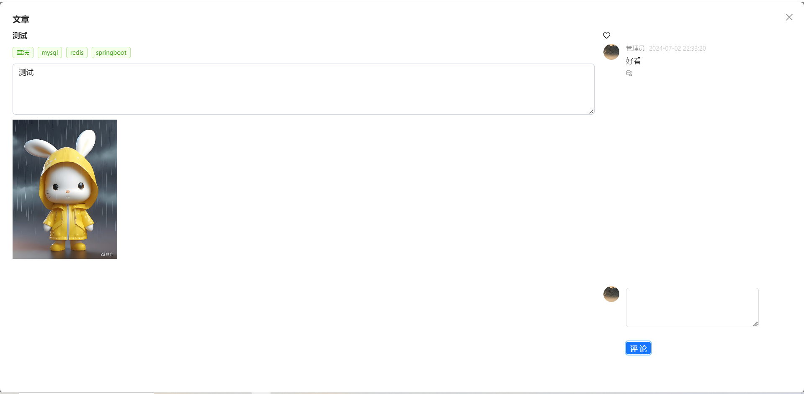
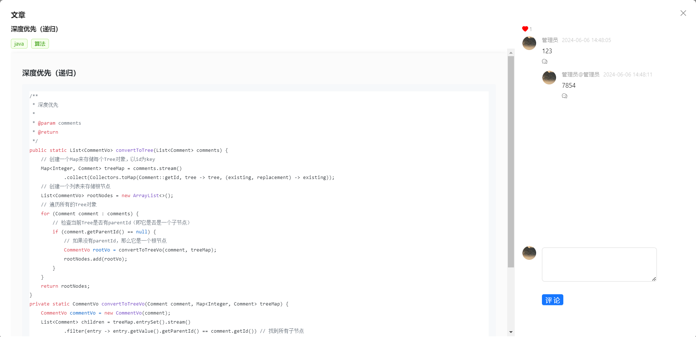
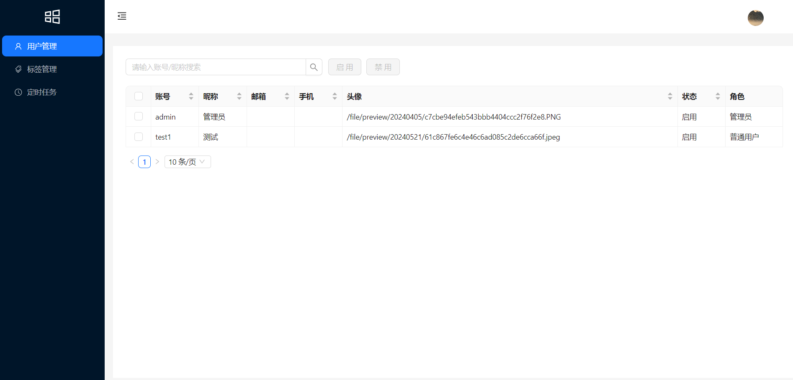
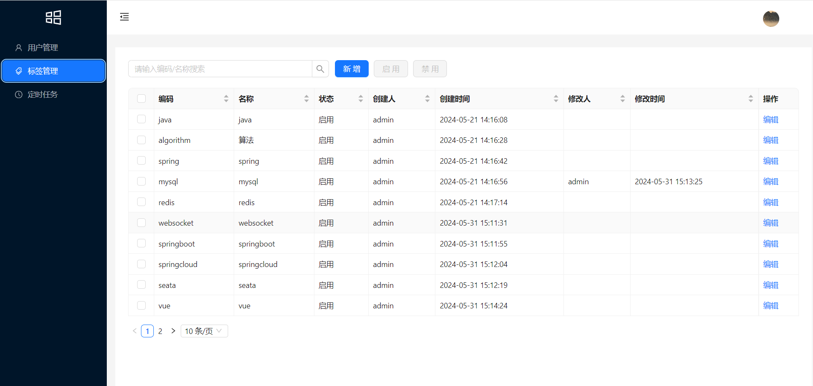
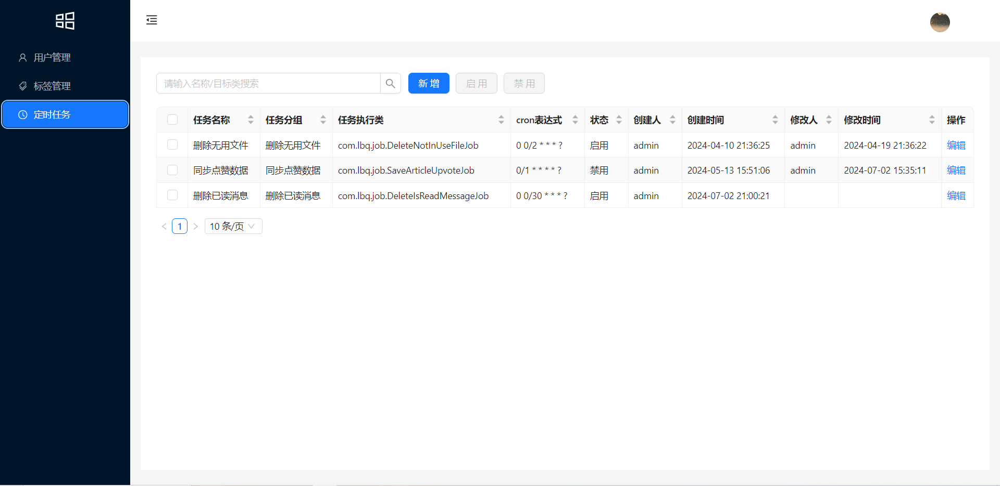
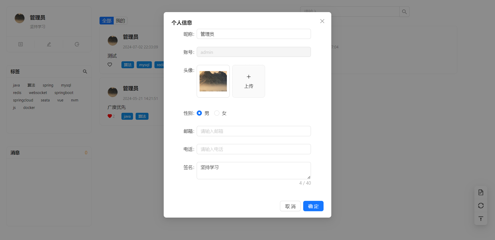

### 资源分享平台
#### 开发模式、技术选型
* 前后端分离模式开发
* 后端开发框架采用Spring Boot、Spring Cloud、Spring Cloud Alibaba、Mybatis-Plus
* 数据库选择Mysql
* 注册中心、配置中心选型Nacos
* 网关权限认证使用Spring Cloud Gateway、Redis
* 数据缓存使用Redis、分布式锁使用Redisson
* 分布式事务选型Seata
* openfeign实现服务之间调用
* 自定义注解 + Aop的方式异步记录用户操作数据
* 使用Redis + 定时任务实现文章点赞功能
* quartz实现定时任务调度
* 基于websocket实现实时消息
* 流量控制框架选型Sentinel（待办）
* 微服务统一日志ELK（待办）
#### 系统模块
```java
rs-cloud
|——rs-authorization     认证中心[8081]
|——rs-common            公共服务
        |——rs-common-core       核心模块
        |——rs-common-global     全局配置
        |——rs-common-log        日志服务
        |——rs-common-openfeign  服务调用配置
        |——rs-common-redis      缓存服务
|——rs-gateway           网关模块[9000]
|——rs-modules           业务模块
        |——rs-article-root      文章模块[8084]
                |——rs-article           文章服务
                |——rs-article-client    文章服务api
        |——rs-file-root     文件模块
                |——rs-file          文件服务
                |——rs-file-client   文件服务api
        |——rs-job           任务调度[8083]
        |——rs-system-root   系统模块
                |——rs-system        系统服务[8082]
                |——rs-system-client 系统服务api
```
#### 内置功能
1. 用户管理
2. 标签管理
3. 定时任务管理
4. 发布文章
5. 文章点赞
6. 文章评论
7. 文件上传
8. 实时消息
#### 演示图












